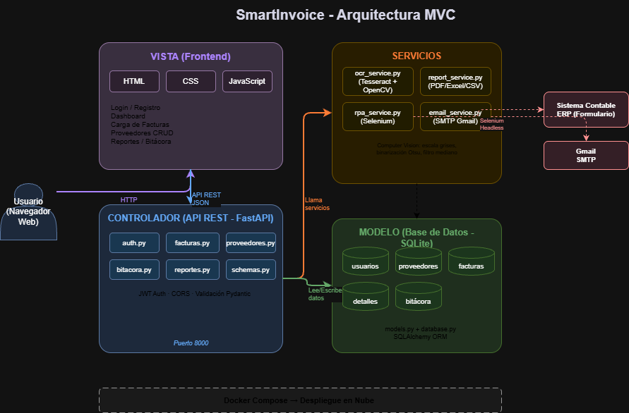
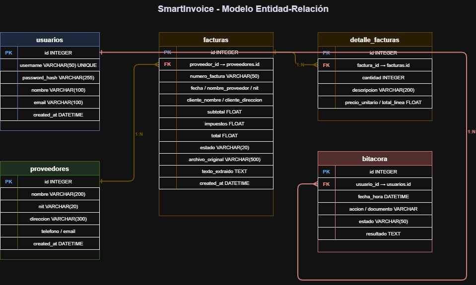

# SmartInvoice - Manual Técnico

## 1. Descripción del Sistema

SmartInvoice es una plataforma inteligente para el procesamiento automático de facturas que integra Computer Vision, OCR (Reconocimiento Óptico de Caracteres) y RPA (Automatización Robótica de Procesos). El sistema permite cargar facturas en formato PDF, JPG, JPEG o PNG, extraer automáticamente la información contenida mediante técnicas de visión por computadora, almacenarla en una base de datos y ejecutar procesos automatizados como generación de reportes, envío de correos y registro en sistemas externos.

## 2. Arquitectura del Sistema

Se implementó el patrón de arquitectura **MVC (Modelo-Vista-Controlador)** con una capa adicional de **Servicios** para la lógica de negocio.



### 2.1 Capas del Sistema

**Vista (Frontend):** Interfaz web desarrollada con HTML, CSS y JavaScript. Se comunica con el backend mediante peticiones HTTP a la API REST. Incluye las secciones de login, dashboard, carga de facturas, gestión de proveedores, reportes y bitácora.

**Controlador (API REST):** Desarrollado con FastAPI en Python. Recibe las peticiones del frontend, las valida con Pydantic, las procesa y devuelve respuestas en formato JSON. Los controladores están organizados por módulo: `auth.py`, `facturas.py`, `proveedores.py`, `bitacora.py` y `reportes.py`.

**Servicios:** Capa intermedia que contiene la lógica de negocio pesada: procesamiento OCR (`ocr_service.py`), generación de reportes (`report_service.py`), envío de emails (`email_service.py`) y automatización RPA (`rpa_service.py`).

**Modelo (Base de Datos):** SQLite gestionada con SQLAlchemy ORM. Define las tablas mediante clases Python en `models.py` y la conexión en `database.py`.

### 2.2 Estructura de Archivos

```
smart-invoice-ocr/
├── backend/
│   ├── main.py                  # Punto de entrada FastAPI
│   ├── database.py              # Conexión a la BD (SQLAlchemy)
│   ├── models.py                # Modelo: tablas de la BD
│   ├── schemas.py               # Validación de datos (Pydantic)
│   ├── requirements.txt         # Dependencias Python
│   ├── routes/                  # Controladores
│   │   ├── auth.py              # Login / Registro
│   │   ├── facturas.py          # Upload y gestión de facturas
│   │   ├── proveedores.py       # CRUD de proveedores
│   │   ├── bitacora.py          # Consulta de historial
│   │   └── reportes.py          # Reportes, email y RPA
│   ├── services/                # Lógica de negocio
│   │   ├── ocr_service.py       # Tesseract + OpenCV
│   │   ├── report_service.py    # PDF / Excel / CSV
│   │   ├── email_service.py     # SMTP Gmail
│   │   └── rpa_service.py       # Selenium headless
│   └── uploads/                 # Archivos subidos
├── frontend/
│   ├── index.html               # Vista principal
│   ├── css/styles.css           # Estilos
│   └── js/app.js                # Lógica del frontend
├── docs/                        # Documentación
├── Dockerfile
└── docker-compose.yml
```

## 3. Tecnologías Utilizadas

| Componente | Tecnología | Justificación |
|------------|-----------|---------------|
| Backend | Python 3.11 + FastAPI | Framework moderno, async, genera documentación Swagger automática |
| Base de datos | SQLite + SQLAlchemy | Ligera, portable, el ORM facilita las consultas sin SQL crudo |
| Frontend | HTML + CSS + JavaScript | Sin frameworks para simplicidad y rendimiento |
| OCR | Tesseract OCR 5.5 | Motor OCR open source más maduro y preciso |
| Computer Vision | OpenCV | Estándar de la industria para procesamiento de imágenes |
| RPA | Selenium + Chrome Headless | Automatización de navegador web estándar |
| Reportes PDF | fpdf2 | Generación nativa de PDFs sin dependencias pesadas |
| Reportes Excel | openpyxl | Creación de archivos .xlsx con estilos y fórmulas |
| Email | smtplib (SMTP) | Librería estándar de Python, compatible con Gmail |
| Contenedores | Docker + Docker Compose | Portabilidad y despliegue consistente |
| Control de versiones | Git + GitHub | Estándar de la industria |

## 4. Modelo de Datos



### 4.1 Tablas

**usuarios** — Cuentas de acceso al sistema.
Campos: `id` (PK), `username` (UNIQUE), `password_hash`, `nombre`, `email`, `created_at`.

**proveedores** — Empresas emisoras de facturas. Se crean automáticamente al procesar facturas o manualmente por el usuario.
Campos: `id` (PK), `nombre`, `nit`, `direccion`, `telefono`, `email`, `created_at`.

**facturas** — Datos extraídos de cada factura procesada.
Campos: `id` (PK), `numero_factura`, `proveedor_id` (FK → proveedores), `fecha`, `nombre_proveedor`, `nit_proveedor`, `cliente_nombre`, `cliente_direccion`, `subtotal`, `impuestos`, `total`, `estado`, `archivo_original`, `texto_extraido`, `created_at`.

**detalle_facturas** — Items/líneas de cada factura.
Campos: `id` (PK), `factura_id` (FK → facturas), `cantidad`, `descripcion`, `precio_unitario`, `total_linea`.

**bitacora** — Registro histórico de todas las acciones del sistema.
Campos: `id` (PK), `usuario_id` (FK → usuarios), `fecha_hora`, `accion`, `documento`, `estado`, `resultado`.

### 4.2 Relaciones

- `proveedores` → `facturas`: **1:N** (un proveedor tiene muchas facturas)
- `facturas` → `detalle_facturas`: **1:N** (una factura tiene muchos items)
- `usuarios` → `bitacora`: **1:N** (un usuario genera muchos registros en bitácora)

## 5. Módulos del Sistema

### 5.1 Módulo de Autenticación

Archivo: `routes/auth.py`

Implementa registro de usuarios con hash SHA-256 y login con JWT (JSON Web Tokens) con expiración de 24 horas. El token se envía en el header `Authorization: Bearer <token>` de cada petición.

### 5.2 Módulo OCR y Computer Vision

Archivo: `services/ocr_service.py`

Este es el módulo central del sistema. El flujo de procesamiento es:

**Preprocesamiento con OpenCV (Computer Vision):**
1. Lectura de imagen con `cv2.imread()`
2. Conversión a escala de grises con `cv2.cvtColor()` — reduce de 3 canales RGB a 1 canal
3. Redimensionamiento a mínimo 1500px de ancho — mayor resolución mejora la precisión del OCR
4. Binarización Otsu con `cv2.threshold()` — convierte a blanco/negro puro con umbral automático
5. Reducción de ruido con `cv2.medianBlur()` — elimina puntos sueltos que confunden al OCR

**Extracción de texto con Tesseract OCR:**
- Motor LSTM (OEM 3) para mayor precisión
- Modo PSM 6 para bloques de texto uniforme
- Idioma español configurado (`-l spa`)

**Parsing con expresiones regulares (Regex):**
Se extraen los campos: número de factura (`FAC-XXXXX`), proveedor, NIT, fecha, cliente, dirección, items de la tabla (cantidad, descripción, precio unitario, total), subtotal, IVA 12% y total.

**Para archivos PDF:**
Primero se intenta extraer texto directo con PyMuPDF (`fitz`). Si el PDF es una imagen escaneada (sin texto embebido), se convierte la página a imagen con resolución 2x y se aplica el flujo de OCR.

### 5.3 Módulo RPA

Archivo: `services/rpa_service.py`

Utiliza Selenium WebDriver con Chrome en modo headless para automatizar el registro de facturas en un sistema contable externo. El bot realiza las siguientes acciones:

1. Abre el formulario del sistema contable
2. Espera a que cargue completamente
3. Localiza cada campo por ID
4. Llena automáticamente: número de factura, proveedor, NIT, fecha, cliente, subtotal, IVA, total
5. Hace click en el botón de registrar
6. Toma screenshots antes y después como evidencia
7. El formulario envía los datos al backend que los registra en la bitácora

### 5.4 Módulo de Reportes

Archivo: `services/report_service.py`

Genera reportes en tres formatos:
- **PDF:** con fpdf2, incluye encabezado, resumen general y tabla con todas las facturas
- **Excel:** con openpyxl, incluye estilos de encabezado, bordes, formatos numéricos y fórmulas de totales
- **CSV:** con el módulo csv estándar de Python

### 5.5 Módulo de Email

Archivo: `services/email_service.py`

Envía correos electrónicos con reportes adjuntos via SMTP con TLS. Compatible con Gmail mediante contraseñas de aplicación. El correo incluye cuerpo HTML con información del reporte y el archivo adjunto.

## 6. API REST - Endpoints

### Autenticación
| Método | Endpoint | Descripción |
|--------|----------|-------------|
| POST | `/api/auth/register` | Registrar usuario nuevo |
| POST | `/api/auth/login` | Iniciar sesión, retorna JWT |

### Proveedores (CRUD)
| Método | Endpoint | Descripción |
|--------|----------|-------------|
| GET | `/api/proveedores/` | Listar todos los proveedores |
| GET | `/api/proveedores/{id}` | Obtener un proveedor |
| POST | `/api/proveedores/` | Crear proveedor |
| PUT | `/api/proveedores/{id}` | Actualizar proveedor |
| DELETE | `/api/proveedores/{id}` | Eliminar proveedor |

### Facturas
| Método | Endpoint | Descripción |
|--------|----------|-------------|
| POST | `/api/facturas/upload` | Subir y procesar factura con OCR |
| GET | `/api/facturas/` | Listar todas las facturas |
| GET | `/api/facturas/{id}` | Ver detalle con items |
| DELETE | `/api/facturas/{id}` | Eliminar factura |

### Reportes, Email y RPA
| Método | Endpoint | Descripción |
|--------|----------|-------------|
| GET | `/api/reportes/pdf` | Descargar reporte PDF |
| GET | `/api/reportes/excel` | Descargar reporte Excel |
| GET | `/api/reportes/csv` | Descargar reporte CSV |
| POST | `/api/reportes/email` | Enviar reporte por correo |
| POST | `/api/reportes/rpa/ejecutar/{id}` | Ejecutar bot RPA |
| GET | `/api/reportes/rpa/form` | Formulario del sistema contable |
| POST | `/api/reportes/rpa/registrar` | Recibe datos del formulario RPA |

### Bitácora
| Método | Endpoint | Descripción |
|--------|----------|-------------|
| GET | `/api/bitacora/` | Listar historial completo |

## 7. Despliegue

### 7.1 Docker

El Dockerfile instala Python 3.11, Tesseract OCR con idioma español, Chromium para Selenium y todas las dependencias Python. Se ejecuta con:

```bash
docker-compose up --build -d
```

### 7.2 Variables de Entorno

| Variable | Descripción | Default |
|----------|-------------|---------|
| `SECRET_KEY` | Clave para firmar JWT | smartinvoice-secret-key-2026 |
| `SMTP_HOST` | Servidor SMTP | smtp.gmail.com |
| `SMTP_PORT` | Puerto SMTP | 587 |
| `SMTP_USER` | Correo remitente | (requerido) |
| `SMTP_PASS` | Contraseña de aplicación | (requerido) |

## 8. Requerimientos Funcionales

- RF01: El sistema permite registrar y autenticar usuarios mediante JWT
- RF02: El sistema permite operaciones CRUD completas de proveedores
- RF03: El sistema permite cargar facturas en formato PDF, JPG, JPEG y PNG
- RF04: El sistema extrae automáticamente información de facturas mediante OCR y Computer Vision
- RF05: El sistema almacena la información extraída en la base de datos
- RF06: El sistema valida automáticamente los datos extraídos (subtotal vs suma de items)
- RF07: El sistema genera reportes en formato PDF, Excel y CSV
- RF08: El sistema envía reportes por correo electrónico automáticamente
- RF09: El sistema registra automáticamente facturas en sistemas externos mediante RPA con Selenium
- RF10: El sistema mantiene una bitácora completa de todas las acciones de procesamiento

## 9. Requerimientos No Funcionales

- RNF01: **Rendimiento** — El OCR procesa una factura en menos de 5 segundos
- RNF02: **Seguridad** — Contraseñas hasheadas con SHA-256, autenticación JWT, CORS configurado
- RNF03: **Portabilidad** — Ejecutable en cualquier sistema operativo con Docker
- RNF04: **Usabilidad** — Interfaz web intuitiva con navegación lateral y drag & drop
- RNF05: **Mantenibilidad** — Código organizado en patrón MVC con separación clara de responsabilidades
- RNF06: **Disponibilidad** — Desplegado en la nube con URL pública accesible 24/7

## 10. Posibles Mejoras Futuras

- Migrar de SQLite a PostgreSQL para mayor robustez en producción
- Implementar procesamiento masivo de múltiples facturas simultáneamente
- Agregar dashboard con gráficas de estadísticas usando Chart.js
- Implementar detección automática de facturas duplicadas
- Agregar validación de formato de NIT guatemalteco
- Implementar colas de tareas con Celery para procesamiento en segundo plano
- Agregar pruebas automatizadas con pytest
