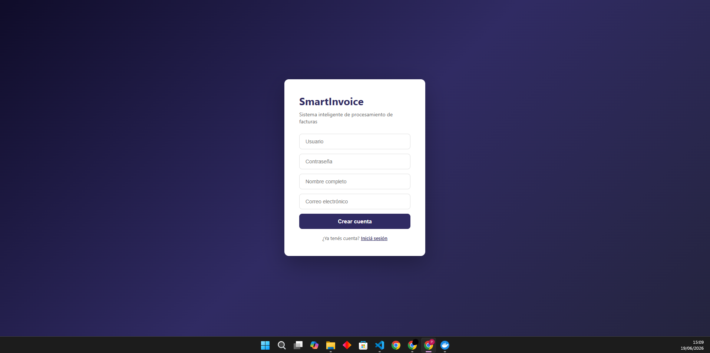
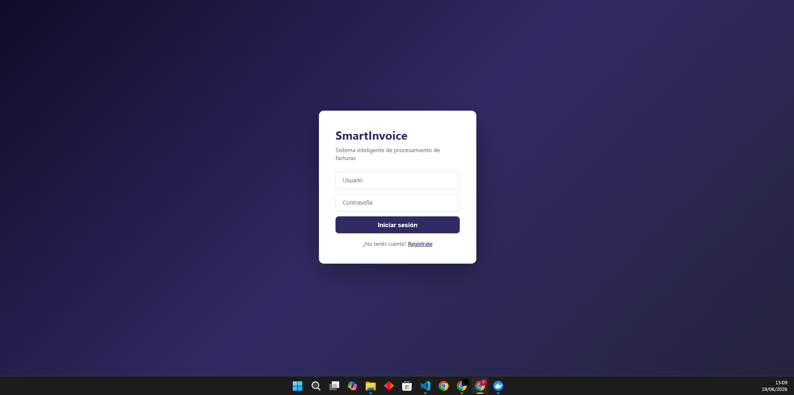
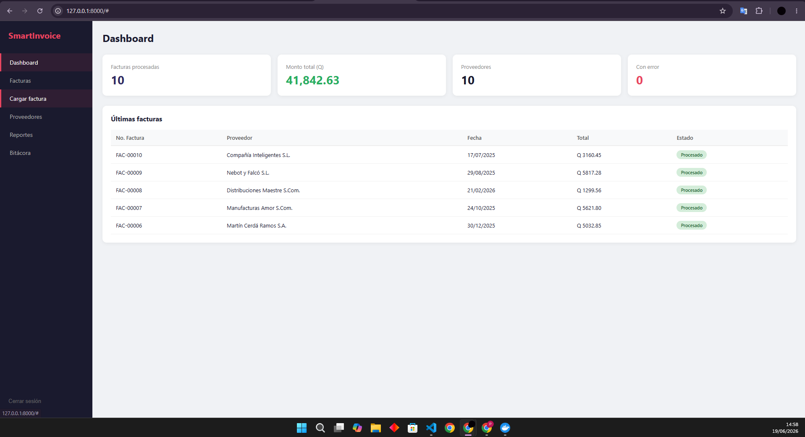
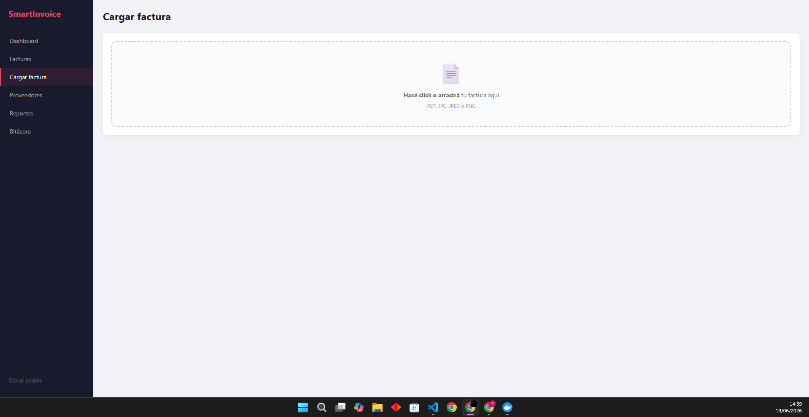
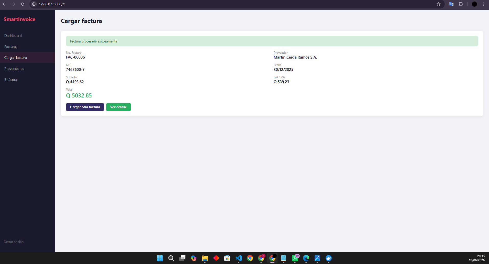
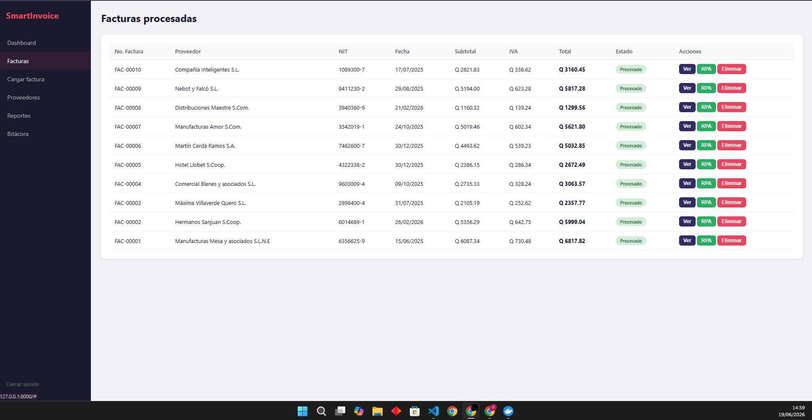
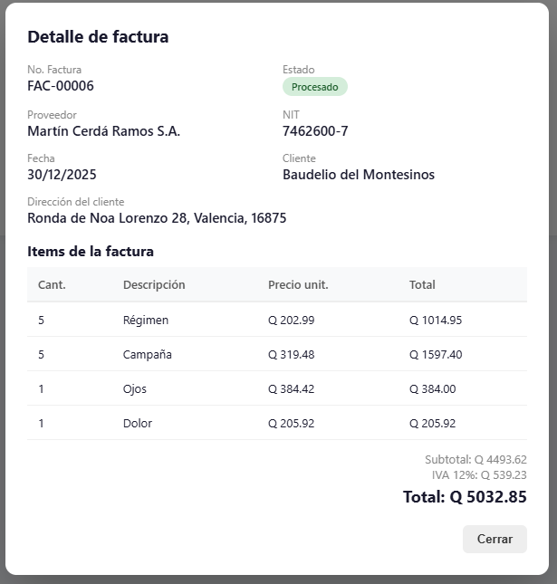
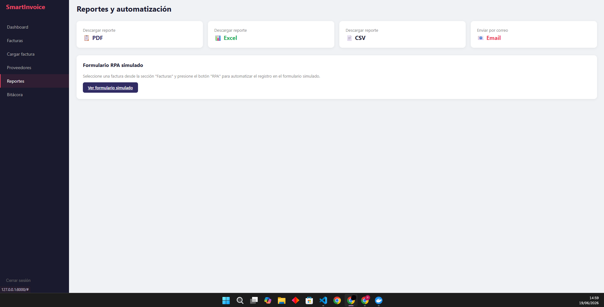

# SmartInvoice - Manual de Usuario

## 1. Introducción

SmartInvoice es un sistema web que automatiza el procesamiento de facturas. Permite cargar facturas en imagen o PDF, extraer automáticamente toda la información (proveedor, NIT, montos, items), generar reportes y registrar la información en sistemas contables de forma automática mediante un bot RPA.

## 2. Acceso al Sistema

### 2.1 Crear una cuenta

Ingrese a la URL del sistema. Si es la primera vez, haga click en **"Registrate"**, complete los campos y presione **"Crear cuenta"**.

### 2.2 Iniciar sesión

Ingrese su usuario y contraseña, luego presione **"Iniciar sesión"**.

## 3. Dashboard

Al ingresar verá el panel principal con estadísticas generales del sistema: cantidad de facturas procesadas, monto total acumulado en Quetzales, número de proveedores registrados y facturas con error. En la parte inferior se muestra una tabla con las últimas facturas procesadas.

## 4. Cargar una Factura

En el menú lateral seleccione **"Cargar factura"**. Haga click en la zona de carga o arrastre el archivo directamente. El sistema acepta archivos PDF, JPG, JPEG y PNG.

Al subir el archivo, el sistema ejecuta automáticamente el siguiente proceso:

1. Aplica Computer Vision (OpenCV) para mejorar la calidad de la imagen
2. Ejecuta OCR (Tesseract) para extraer el texto
3. Analiza el texto con expresiones regulares para identificar cada campo
4. Valida que los datos sean coherentes
5. Guarda la factura y sus detalles en la base de datos
6. Registra la acción en la bitácora

Al finalizar se muestran los datos extraídos:

## 5. Gestión de Facturas

En la sección **"Facturas"** se muestra la tabla completa de facturas procesadas con número, proveedor, NIT, fecha, subtotal, IVA, total y estado. Cada factura tiene tres acciones disponibles: **Ver** (detalle completo), **RPA** (registrar en sistema contable) y **Eliminar**.

Al presionar **"Ver"** se abre el detalle con todos los items extraídos de la factura, incluyendo cantidad, descripción, precio unitario y total por línea.

## 6. Gestión de Proveedores

En la sección **"Proveedores"** puede ver todos los proveedores registrados. Los proveedores se crean automáticamente al procesar facturas, pero también puede crearlos o editarlos manualmente con el botón **"+ Nuevo proveedor"**.

## 7. Reportes

La sección **"Reportes"** ofrece cuatro opciones para generar y compartir información:

- **PDF:** Descarga un reporte con tabla de facturas y resumen de montos
- **Excel:** Descarga un archivo .xlsx con datos formateados y fórmulas
- **CSV:** Descarga un archivo .csv para importar en otros sistemas
- **Email:** Envía el reporte como archivo adjunto por correo electrónico

### Reporte PDF generado

### Reporte enviado por correo

Al presionar **"Email"** se le pide el correo destino y el formato. El sistema genera el reporte y lo envía automáticamente.

## 8. Automatización RPA

El sistema incluye un bot de automatización que toma los datos de una factura ya procesada y los registra automáticamente en un sistema contable externo, replicando lo que haría un empleado manualmente.

Para ejecutar el RPA, vaya a la sección **"Facturas"** y presione el botón **"RPA"** en la factura deseada. El bot abrirá el formulario del sistema contable, llenará todos los campos automáticamente, presionará registrar y tomará screenshots como evidencia.

Todo queda registrado en la bitácora con la acción `RPA_REGISTRO_AUTOMATICO`.

## 9. Bitácora

La sección **"Bitácora"** muestra el historial completo de todas las acciones del sistema en orden cronológico. Cada registro incluye fecha/hora, tipo de acción, documento involucrado, estado (éxito o error) y descripción del resultado.

Las acciones registradas incluyen: registro de usuarios, inicio de sesión, carga de facturas, procesamiento OCR, generación de reportes, envío de correos y ejecuciones RPA.

## 10. Documentación de la API

El sistema genera documentación interactiva automáticamente accesible en la ruta `/docs` (Swagger UI). Desde ahí se pueden probar todos los endpoints de la API directamente desde el navegador.
